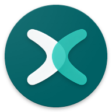
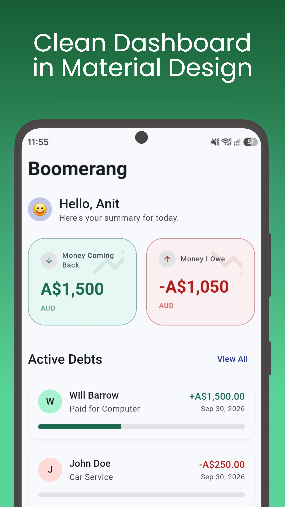
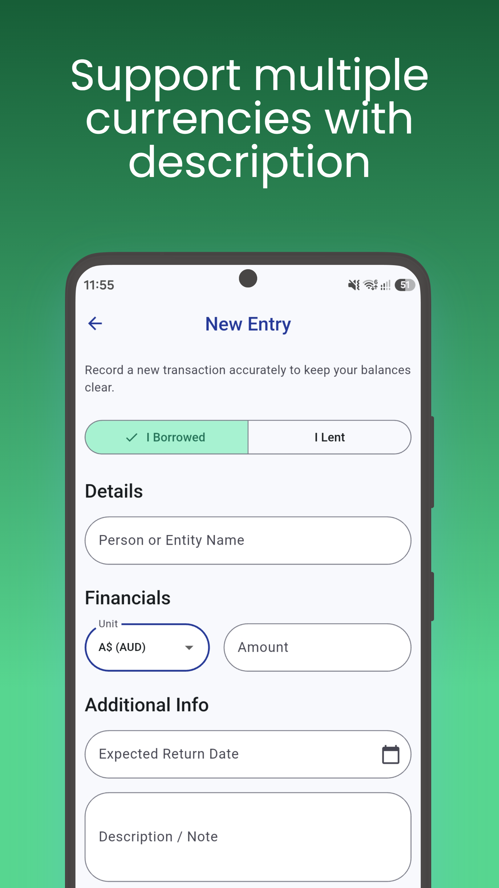
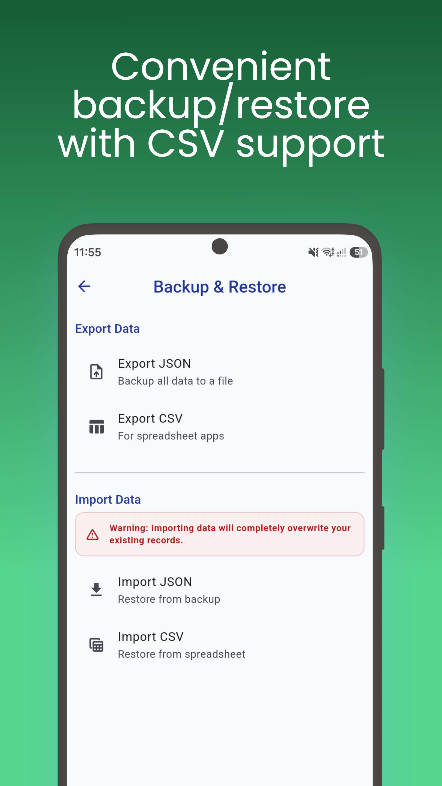

#  Boomerang

**Boomerang** is a clean, minimal, and intuitive debt management app built with Flutter. It helps you keep track of money you've borrowed or lent to friends, ensuring that what goes around, always comes back!

## 📸 Screenshots

  
  
  

## ✨ Features

- **Track Debts & Loans:** Easily record who owes you money and who you owe money to.
- **Partial Payments:** Add incremental payments to a debt until the remaining balance is settled.
- **Automated Reminders:** Never forget a due date! Boomerang automatically schedules exact-time local notifications to remind you on the expected return date.
- **Multi-Currency Support:** Traveling? No problem. Record debts in various global currencies.
- **Data Export & Import:** Securely export your data to CSV or JSON formats, and import it back whenever you switch devices.
- **Dark & Light Mode:** Beautiful UI that respects your system's theme preferences.

## 📦 Tech Stack

- **Framework:** Flutter / Dart
- **State Management:** Provider
- **Local Storage:** SharedPreferences
- **Notifications:** flutter_local_notifications

---
*Made with ❤️ using Flutter.*
